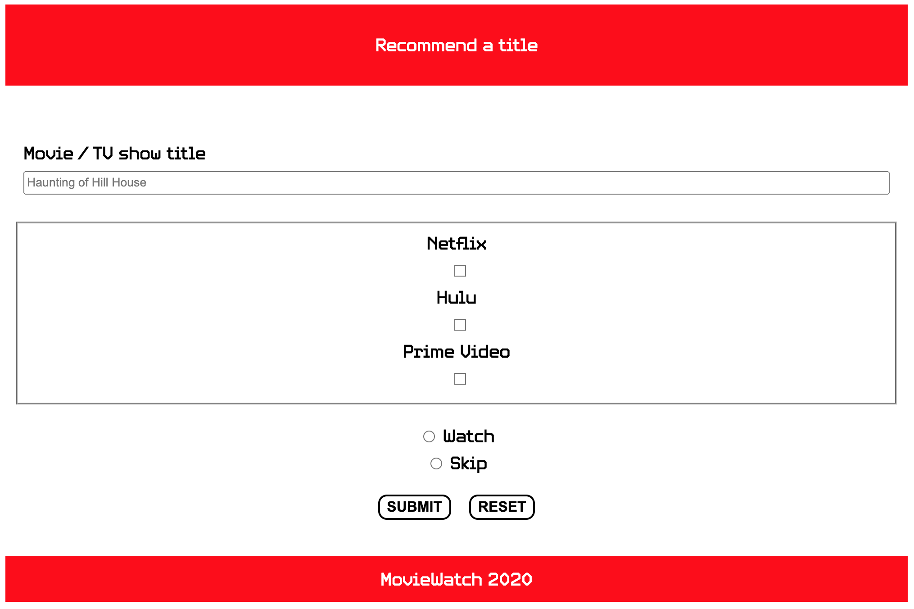
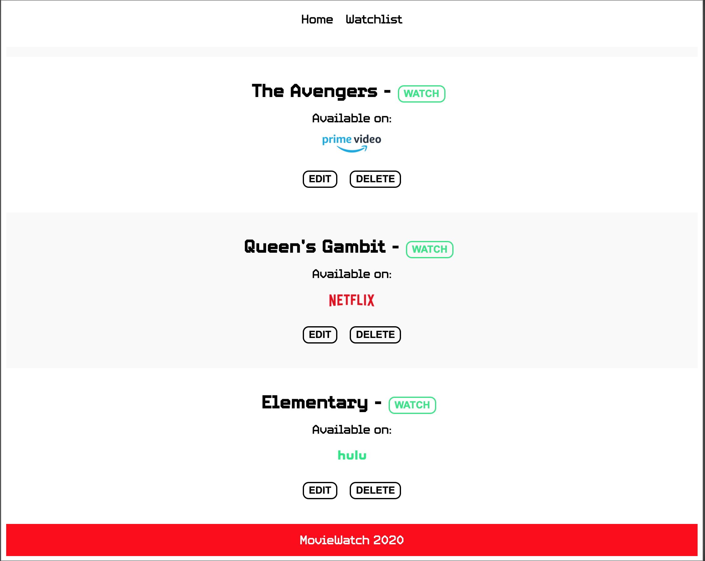

# MovieWatch App

## Live Link to App: https://moviewatch-app.vercel.app/

### Documentation

MovieWatch is an application you can recommend a movie or tv show title, rate it "Watch" or "Skip", and tag the streaming services ( Netflix, Hulu, Prime Video ) to keep track of where to find the recommended title.

The list item is then created and displayed on the '/watchlist' endpoint.
Here the user is able to view the complete Watchlist in order of creation with new and updated titles appended to the bottom of the list.

The user now has the option to delete the list item or edit the title which routes the user to '/edit/:itemId' and renders the EditForm to select new values for the StreamingOptions and RatingOptions components and submits the new list item to the watchlist.

